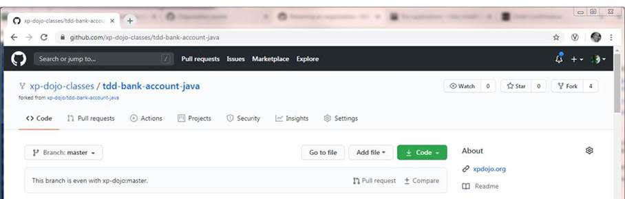
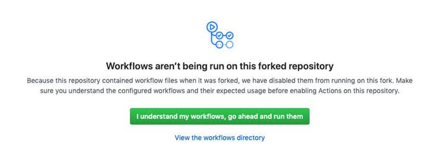
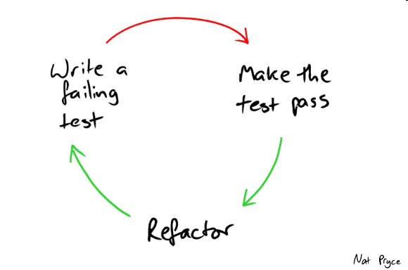

# Driving out a Bank Account with TDD

This session will be fun. That's the primary objective, have fun and code. That's it! In this session we will talk for a little bit about why XP practices are important and then we can write some code practicing two of the most fundamental ones. 

The code will be super easy, this is not about writing complicated code, quite the opposite. We will get pairs of you to build really simple test driven code. It will make you rethink how you write code. For those of you after more of a challenge, we have included some optional Object Oriented (calisthenics) rules to apply.

Come in pairs or make new friends on the day. Please all __bring your own laptop__  with your favourite IDE installed.

Two key things to learn / practice in this Kata:

1. Test Driven Development
1. Pair programming

# Instructions

1. Fork the repository on Github. Click the ‘fork’ button in the top right to fork into your account.

   Fork from https://github.com/xp-dojo-classes/tdd-bank-account-java

   

1. In your new fork, click on the “Actions” tab and then on the “I understand my workflows, go ahead and run them”

   

1. Having forked into your own account, you then clone to download it from Github to your working machine:

   `git clone https://github.com/<your account name>/tdd-bank-account-java.git`

   If you have problems with a proxy, you can unset http_proxy and unset https_proxy (or equivalent for your OS).

1. Import the project in IntelliJ IDEA ([Community Edition](https://www.jetbrains.com/idea/download/) is fine).

   It has a Gradle build file which should be detected automatically. See the [JetBrains Gradle plugin help](https://www.jetbrains.com/help/idea/gradle.html#gradle_import_project_start) for some tips. 
   
   If you have problems with IntelliJ, see the [Troubleshooting](troubleshooting.md) document.

1. You should now be able to run the `build` task from within the Gradle menu on the right-hand side of IntelliJ.

1. Implement the following user requirements in a TDD fashion. Work in pairs and read the guidelines and background information below before starting.

## User Requirements

 1. I can **Deposit** money to accounts
 1. I can **Withdraw** money from accounts
 1. I can **Transfer** amounts between accounts (if I have the funds)
 1. I can print out an Account balance slip (date, time, balance) 
 1. I can print a statement of account activity (statement) 
 1. I can apply Statement filters (include just deposits, withdrawal, date)

# Guidelines and Background

## Test Driven Development

Test driven development is based on the principles of test-first development (where you write the test first) but goes an extra step to actually driving the code using the IDE. The basic cycle follows the __Red -> Green -> Refactor__ model:

 - __Red__: write a failing test. Write a test that describes (think documentation) what the function you are writing actually does. Likely this will not even compile (this is fine, not compiling IS a failing test).
 - __Green__: now write enough of an implementation to make the test pass. You should write the simplest code possible to make the code pass and resist the urge to write more than is actually needed. Consider the [YAGNI](https://martinfowler.com/bliki/Yagni.html) principle.
 - __Refactor__: now we re-read the code and make sure that this is good enough to push to the _world at large_. You should ask yourself at this point how the next person that reads this code will experience it.

As a walkthrough consider applying TDD as a two stage process, the first phase writes the API in the test __as it should be__ (write the code you would like someone else to have written for you). In this case the compiler _IS_ the failing test, you rewrite it until you are happy and then to make it go green you use the IDE to create the classes and methods as per the test (dont type them, let the IDE do the work). The next phase of the cycle implements the methods to get the unit tests passing, followed by the refactoring to complete the RGR cycle described above. The key message here is that you should consider the compiler failing as a failing test to allow you to get it green (alt+enter until it all compiles).

## Pair Programming

There are many different ways to do pair programming, the most common model is the Driver-Navigator model. For this kata, try and follow as below for simplicity. There are two roles in this model (you should switch often to keep it interesting):

 - __The Driver__ is the person wiring the code (test driven) and implementing. The Driver should be explaining what they are doing in a running monologue so the Navigator understands the direction taken and can assess it (also it keeps the Navigator engaged).
 - __The Navigator__ is the person observing and thinking about the big picture. The best Navigators are those that ask __why?__ often to check that we __build the right thing, and build the thing right__. For this kata, the Navigator is checking that they are really test driving (using the IDE) and that the code __does what it says and says what it does__. When applying object calisthenics the Navigator should be checking that the Nine rules are not being broken. Correction and learning is the key here.

## Object Calisthenics

Object calisthenics are a set of rules or constraints designed to challenge and stretch yourself when applied to OO coding. For an extra challenge when implementing the user requirements, consider applying rules below.

### The Rules (bold ones are MUST)

1. __Use only one level of indentation per method__
1. __Don’t use the `else` keyword__
1. __Wrap all primitives and strings (in an object)__
1. __No getters/setters/properties__
1. __First class collections__
1. Use only one dot per line
1. Don’t abbreviate
1. Keep all entities small (50 lines)
1. No classes with more than two instance variables

See the links below for more details.

# Additional Information

- Project based on the original from Sandro Mancuso and the LSCC
- Original idea for the kata: [How Object-Oriented Are You Feeling Today?](https://www.slideshare.net/KrzysztofJelski/how-object-oriented-are-you-feeling-today) - Krzysztof Jelski (Session on the Software Craftsmanship UK 2011 conference)
- [Object Calisthenics pdf](http://www.cs.helsinki.fi/u/luontola/tdd-2009/ext/ObjectCalisthenics.pdf)
- Object Calisthenics (full book), Jeff Bay in: The ThoughtWorks Anthology. Pragmatic Bookshelf 2008

# License

The content of this project (educational material, slides and alike) are licensed under the Creative Commons Attribution Share Alike 4.0 International (CC-BY-SA) license, whilst the underlying source code used to support the educational material is licensed under the Apache 2.0 license.
