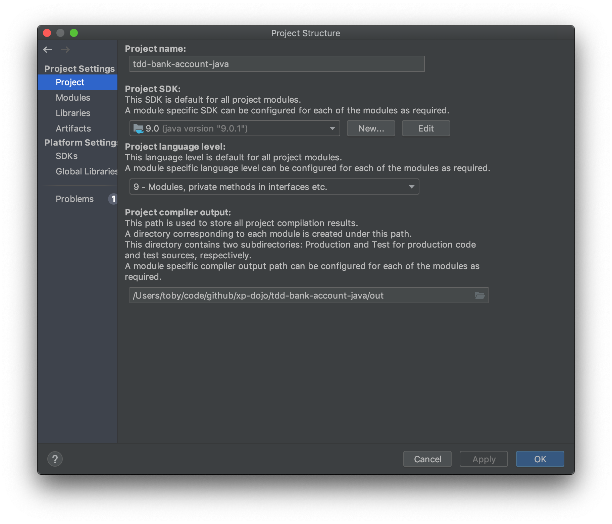

# Troubleshooting

## IntelliJ

If you open the project in IntelliJ IDEA and have problems with the SDK and/or the output folder not being set, set both in the project settings below (Hint: try running all tests in the `test` folder). 

